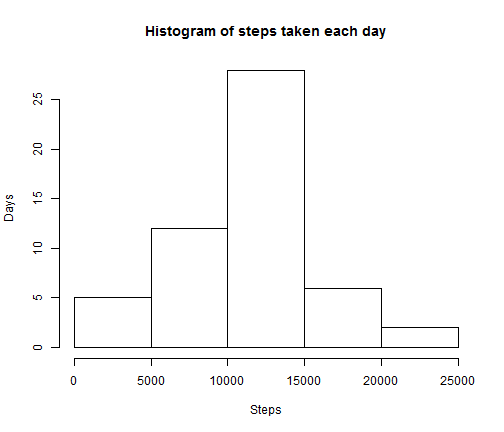
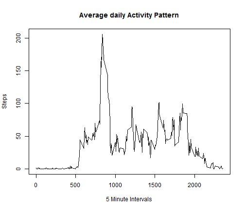
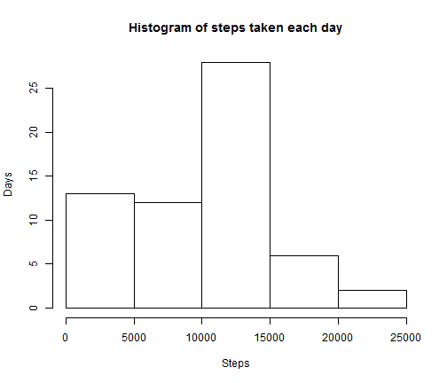
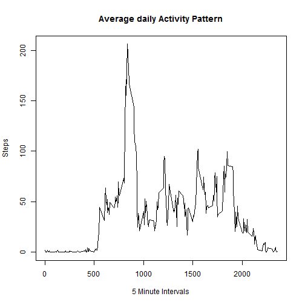

Assignment 1:


```r
setwd("C:/Users/Amarnath/RepData_PeerAssessment1")
dfActivity <- read.csv("activity.csv")
```

Question 1
-------------


```r
stepsByDay <- aggregate(dfActivity$steps, by = list(date = as.Date(dfActivity$date)), sum)
hist(stepsByDay$x, xlab = "Steps", ylab = "Days", main = "Histogram of steps taken each day")
```

 

```r
mean(stepsByDay$x, na.rm = TRUE)
```

```
## [1] 10766
```

```r
median(stepsByDay$x, na.rm = TRUE)
```

```
## [1] 10765
```

Question 2
----------


```r
dfa_withoutNA <- na.omit(dfActivity)
meanStepsByInterval <- aggregate(dfa_withoutNA$steps, FUN ="mean", by = list(dfa_withoutNA$interval), na.action = na.omit)
byInterval <- aggregate(dfa_withoutNA$steps, FUN ="mean", by = list(interval = dfa_withoutNA$interval), na.action = na.omit)

plot(byInterval$interval, 
     byInterval$x, type = "l", 
     main = "Average daily Activity Pattern",
     xlab = "5 Minute Intervals",
     ylab = "Steps")
```

 

```r
meanStepsByInterval[which.max(meanStepsByInterval$x),1]
```

```
## [1] 835
```

Question 3
----------
Calculate the total Number of missing values in the Data Set

```r
  print("Count of Rows that has NAs:")
```

```
## [1] "Count of Rows that has NAs:"
```

```r
  sum(!complete.cases(dfActivity))
```

```
## [1] 2304
```
Strategy for Replacing NAs. Here NAs in Steps are replaced with Mean steps for each day. Note: if mean is NaN, then it is replaced with 0.


```r
## replace NAs
  require("plyr")
```

```
## Loading required package: plyr
```

```
## Warning: package 'plyr' was built under R version 3.1.1
```

```r
  impute.mean <- function(x) 
    {
     y <- replace(x, is.na(x), mean(x, na.rm = TRUE)) 
     replace(y, is.nan(y), 0)
    
    }
  dfa_imput <- ddply(dfActivity, ~ date, transform, steps = impute.mean(steps))
```

Now, The NAs are replaced with Mean steps for that day, the histogram of total steps taken each day is plotted.


```r
  stepsByDay <- aggregate(dfa_imput$steps, 
                          by = list(date = as.Date(dfa_imput$date)), sum)
  hist(stepsByDay$x, xlab = "Steps", ylab = "Days", 
       main = "Histogram of steps taken each day")
```

 

The mean and median of total steps taken in all days is listed below


```r
  mean(stepsByDay$x, na.rm = TRUE)
```

```
## [1] 9354
```

```r
  median(stepsByDay$x, na.rm = TRUE)
```

```
## [1] 10395
```
Create a factor variable with "Weekday" and "Weekend" as values and add that column along with data frame for which we imputed values for NA above.


```r
  weekFactor <- sub("Saturday|Sunday", "Weekend", 
                    weekdays(as.Date(dfa_imput$date)))
  weekFactor <- replace(weekFactor, grep("Weekend", invert = TRUE, weekFactor), "Weekday")
  dfa_imput["week"] <- factor(weekFactor)

meanByInterval <- aggregate(dfa_imput$steps, FUN ="mean", by = list(interval = dfa_imput$interval), na.action = na.omit)

plot(meanByInterval$interval, 
     byInterval$x, type = "l", 
     main = "Average daily Activity Pattern",
     xlab = "5 Minute Intervals",
     ylab = "Steps")
```

 
